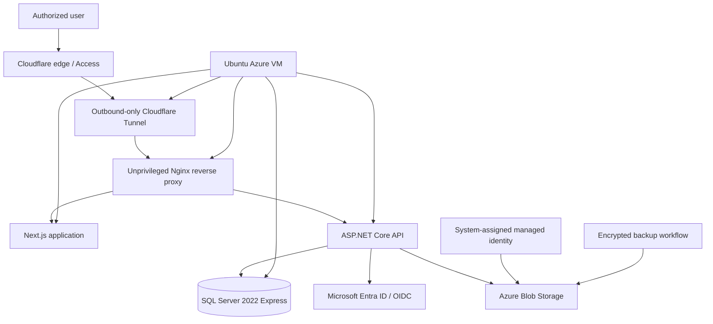

# ALMS Azure Infrastructure Portfolio

A **sanitized infrastructure case study** documenting the Azure staging architecture, security controls, deployment planning, SQL Server Express compatibility work, and disaster-recovery design prepared for an internal leave-management system.

> **Portfolio scope:** This repository contains architecture and engineering evidence only. It does **not** contain production application source, employee data, credentials, tenant IDs, connection strings, certificates, private keys, Cloudflare tokens, or real environment configuration.

## What this project demonstrates

- Azure infrastructure design with **Bicep**
- Ubuntu Linux and Docker-based application hosting
- Microsoft Entra ID / OIDC authentication design
- system-assigned managed identity and Azure RBAC
- private Azure Blob containers for documents and encrypted backups
- VNet, subnet, NSG, NIC, and explicit outbound-connectivity design
- Cloudflare Tunnel for outbound-only application publishing
- SQL Server 2022 Express compatibility analysis
- replacement of SQL Server Agent scheduling with Linux/systemd workflows
- encrypted backup and automated restore-test design
- release runbooks, rollback boundaries, secret handling, and go/no-go controls
- budget-aware Azure architecture and cost modelling

## Project status

The Azure deployment artifacts were prepared and the Bicep template was **statically compiled successfully with zero diagnostics**. The source project deliberately did **not** claim a completed Azure deployment at that stage: Azure `validate`, `what-if`, resource creation, Entra configuration, Cloudflare configuration, SQL migration execution, and end-to-end staging tests remained approval-gated.

That distinction is intentional. This portfolio represents **designed and statically validated infrastructure-as-code and operational architecture**, not a claim that every component was deployed to production.

## Reference architecture

The application and database are not published through Docker host ports. SQL remains on the internal Docker network. The Azure NSG design does not expose application or SQL ports to the Internet.

## Case-study sections

- [Azure Architecture](docs/azure-architecture.md)
- [Security Design](docs/security-design.md)
- [SQL Server Express Compatibility](docs/sql-express-compatibility.md)
- [Backup & Disaster Recovery](docs/backup-and-dr.md)
- [Cost & Architecture Trade-offs](docs/cost-and-tradeoffs.md)

## Engineering principles demonstrated

1. **Do not confuse design with deployment.** Static compilation is evidence; it is not proof of a successful production release.
2. **Use managed identity where possible.** Avoid embedding storage credentials in application source or deployment artifacts.
3. **Keep data services private.** Publishing SQL Server directly to the Internet was explicitly prohibited.
4. **Adapt architecture to edition constraints.** SQL Server Express limitations were handled with external schedulers and encryption rather than ignored.
5. **Backups require recovery evidence.** Media verification alone is insufficient.
6. **Budget is an architecture input.** Security, availability and cost trade-offs were documented rather than hidden.
7. **Risk acceptance expires.** Temporary staging risk decisions were time-bounded and did not authorize production.

## Important limitations

This repository does **not** claim:

- that the documented Azure environment was deployed to production;
- that proposed RPO/RTO targets were measured SLAs;
- multi-region high availability;
- that SQL Server Express remains appropriate near its edition limits;
- that temporary staging vulnerability acceptances remain current;
- that restricted-staging validation equals production certification.

## Skills demonstrated

`Azure` · `Bicep` · `Microsoft Entra ID` · `Managed Identity` · `Azure RBAC` · `Azure Blob Storage` · `Virtual Networks` · `NSG` · `Ubuntu` · `Docker` · `Cloudflare Tunnel` · `SQL Server` · `systemd` · `Backup & Recovery` · `Infrastructure Security` · `Cost Optimization` · `Release Engineering`

---

**Derek Asamoah-Amoyaw**  
Senior IT Infrastructure & Cloud Engineer · Microsoft Certified: Azure Administrator Associate (AZ-104)  
[GitHub Profile](https://github.com/Deberryx) · [LinkedIn](https://www.linkedin.com/in/derek-asamoah-ctfl-143650b8/)
